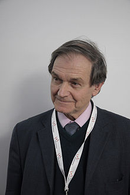

<table class="infobox biography vcard">
<tbody>
<tr>
<th colspan="2">

<a title="Sir" href="https://en.wikipedia.org/wiki/Sir">Sir</a>

 

Roger Penrose

 

<a class="mw-redirect" title="Member of the Order of Merit" href="https://en.wikipedia.org/wiki/Member_of_the_Order_of_Merit">OM</a>&nbsp;<a title="Fellow of the Royal Society" href="https://en.wikipedia.org/wiki/Fellow_of_the_Royal_Society">FRS</a>

</th>
</tr>
<tr>
<td colspan="2">

Penrose in 2011

</td>
</tr>
<tr>
<th scope="row">Born</th>
<td>8 August 1931&nbsp;(age&nbsp;88) 

<a title="Colchester" href="https://en.wikipedia.org/wiki/Colchester">Colchester</a>, England

</td>
</tr>
<tr>
<th scope="row">Nationality</th>
<td class="category">British</td>
</tr>
<tr>
<th scope="row">Alma&nbsp;mater</th>
<td>

<ul>
<li><a class="mw-redirect" title="University College, London" href="https://en.wikipedia.org/wiki/University_College,_London">University College, London</a></li>
<li><a class="mw-redirect" title="St John&rsquo;s College, Cambridge" href="https://en.wikipedia.org/wiki/St_John%E2%80%99s_College,_Cambridge">St John&rsquo;s College, Cambridge</a></li>
</ul>

</td>
</tr>
<tr>
<th scope="row">Known&nbsp;for</th>
<td>

<ul>
<li><a title="Twistor theory" href="https://en.wikipedia.org/wiki/Twistor_theory">Twistor theory</a></li>
<li><a title="Spin network" href="https://en.wikipedia.org/wiki/Spin_network">Spin network</a></li>
<li><a title="Abstract index notation" href="https://en.wikipedia.org/wiki/Abstract_index_notation">Abstract index notation</a></li>
<li><a title="Black hole bomb" href="https://en.wikipedia.org/wiki/Black_hole_bomb">Black hole bomb</a></li>
<li><a title="Spacetime" href="https://en.wikipedia.org/wiki/Spacetime">Geometry of spacetime</a></li>
<li><a title="Cosmic censorship hypothesis" href="https://en.wikipedia.org/wiki/Cosmic_censorship_hypothesis">Cosmic censorship</a></li>
<li><a title="Weyl curvature hypothesis" href="https://en.wikipedia.org/wiki/Weyl_curvature_hypothesis">Weyl curvature hypothesis</a></li>
<li><a class="mw-redirect" title="Contributors to general relativity" href="https://en.wikipedia.org/wiki/Contributors_to_general_relativity#P">Penrose inequalities</a></li>
<li><a class="mw-redirect" title="Penrose interpretation of quantum mechanics" href="https://en.wikipedia.org/wiki/Penrose_interpretation_of_quantum_mechanics">Penrose interpretation of quantum mechanics</a></li>
<li><a class="mw-redirect" title="Moore&ndash;Penrose pseudoinverse" href="https://en.wikipedia.org/wiki/Moore%E2%80%93Penrose_pseudoinverse">Moore&ndash;Penrose pseudoinverse</a></li>
<li><a title="Newman&ndash;Penrose formalism" href="https://en.wikipedia.org/wiki/Newman%E2%80%93Penrose_formalism">Newman&ndash;Penrose formalism</a></li>
<li><a title="Penrose diagram" href="https://en.wikipedia.org/wiki/Penrose_diagram">Penrose diagram</a></li>
<li><a class="mw-redirect" title="Penrose inequality" href="https://en.wikipedia.org/wiki/Penrose_inequality">Penrose inequality</a></li>
<li><a title="Penrose process" href="https://en.wikipedia.org/wiki/Penrose_process">Penrose process</a></li>
<li><a title="Penrose tiling" href="https://en.wikipedia.org/wiki/Penrose_tiling">Penrose tiling</a></li>
<li><a title="Penrose stairs" href="https://en.wikipedia.org/wiki/Penrose_stairs">Penrose stairs</a></li>
<li><a title="Penrose graphical notation" href="https://en.wikipedia.org/wiki/Penrose_graphical_notation">Penrose graphical notation</a></li>
<li><a title="Penrose transform" href="https://en.wikipedia.org/wiki/Penrose_transform">Penrose transform</a></li>
<li><a title="Terrell rotation" href="https://en.wikipedia.org/wiki/Terrell_rotation">Penrose-Terrell effect</a></li>
<li><a title="Pp-wave spacetime" href="https://en.wikipedia.org/wiki/Pp-wave_spacetime">pp-wave spacetime</a></li>
<li><a class="mw-redirect" title="Schr&ouml;dinger&ndash;Newton equations" href="https://en.wikipedia.org/wiki/Schr%C3%B6dinger%E2%80%93Newton_equations">Schr&ouml;dinger&ndash;Newton equations</a></li>
<li><a class="mw-redirect" title="Orch-OR" href="https://en.wikipedia.org/wiki/Orch-OR">Orch-OR</a>/<a title="Penrose&ndash;Lucas argument" href="https://en.wikipedia.org/wiki/Penrose%E2%80%93Lucas_argument">Penrose&ndash;Lucas argument</a></li>
<li><a title="Free-orbit experiment with laser interferometry X-rays" href="https://en.wikipedia.org/wiki/Free-orbit_experiment_with_laser_interferometry_X-rays">FELIX experiment</a></li>
<li><a title="Trapped surface" href="https://en.wikipedia.org/wiki/Trapped_surface">Trapped surface</a></li>
<li><a class="mw-redirect" title="Andromeda paradox" href="https://en.wikipedia.org/wiki/Andromeda_paradox">Andromeda paradox</a></li>
<li><a title="Conformal cyclic cosmology" href="https://en.wikipedia.org/wiki/Conformal_cyclic_cosmology">Conformal cyclic cosmology</a></li>
</ul>

</td>
</tr>
<tr>
<th scope="row">Awards</th>
<td>

<ul>
<li><a title="Adams Prize" href="https://en.wikipedia.org/wiki/Adams_Prize">Adams Prize</a>&nbsp;1966</li>
<li><a title="Dannie Heineman Prize for Mathematical Physics" href="https://en.wikipedia.org/wiki/Dannie_Heineman_Prize_for_Mathematical_Physics">Heineman Prize</a>&nbsp;(1971)</li>
<li><a title="Fellow of the Royal Society" href="https://en.wikipedia.org/wiki/Fellow_of_the_Royal_Society">Fellow of the Royal Society</a>&nbsp;(1972)</li>
<li><a title="Eddington Medal" href="https://en.wikipedia.org/wiki/Eddington_Medal">Eddington Medal</a>&nbsp;(1975)</li>
<li><a title="Royal Medal" href="https://en.wikipedia.org/wiki/Royal_Medal">Royal Medal</a>&nbsp;(1985)</li>
<li><a title="Wolf Prize" href="https://en.wikipedia.org/wiki/Wolf_Prize">Wolf Prize</a>&nbsp;(1988)</li>
<li><a class="mw-redirect" title="Dirac Prize" href="https://en.wikipedia.org/wiki/Dirac_Prize">Dirac Medal</a>&nbsp;(1989)</li>
<li><a title="Albert Einstein Medal" href="https://en.wikipedia.org/wiki/Albert_Einstein_Medal">Albert Einstein Medal</a>&nbsp;(1990)</li>
<li><a title="Naylor Prize and Lectureship" href="https://en.wikipedia.org/wiki/Naylor_Prize_and_Lectureship">Naylor Prize and Lectureship</a>&nbsp;(1991)</li>
<li><a title="James Scott Prize Lectureship" href="https://en.wikipedia.org/wiki/James_Scott_Prize_Lectureship">James Scott Prize Lectureship</a>&nbsp;(1997&ndash;2000)</li>
<li><a title="Karl Schwarzschild Medal" href="https://en.wikipedia.org/wiki/Karl_Schwarzschild_Medal">Karl Schwarzschild Medal</a>&nbsp;(2000)</li>
<li><a title="De Morgan Medal" href="https://en.wikipedia.org/wiki/De_Morgan_Medal">De Morgan Medal</a>&nbsp;(2004)</li>
<li><a title="Copley Medal" href="https://en.wikipedia.org/wiki/Copley_Medal">Copley Medal</a>&nbsp;(2008)</li>
<li><a title="Fonseca Prize" href="https://en.wikipedia.org/wiki/Fonseca_Prize">Fonseca Prize</a>&nbsp;(2011)</li>
</ul>

</td>
</tr>
<tr>
<td colspan="2"><strong>Scientific career</strong></td>
</tr>
<tr>
<th scope="row">Fields</th>
<td class="category"><a title="Mathematical physics" href="https://en.wikipedia.org/wiki/Mathematical_physics">Mathematical physics</a>,&nbsp;<a title="Tessellation" href="https://en.wikipedia.org/wiki/Tessellation">tessellations</a></td>
</tr>
<tr>
<th scope="row">Institutions</th>
<td>

<ul>
<li><a title="Bedford College, London" href="https://en.wikipedia.org/wiki/Bedford_College,_London">Bedford College, London</a></li>
<li><a title="Princeton University" href="https://en.wikipedia.org/wiki/Princeton_University">Princeton University</a></li>
<li><a title="Syracuse University" href="https://en.wikipedia.org/wiki/Syracuse_University">Syracuse University</a></li>
<li><a class="mw-redirect" title="King's College, London" href="https://en.wikipedia.org/wiki/King%27s_College,_London">King's College, London</a></li>
<li><a title="Birkbeck, University of London" href="https://en.wikipedia.org/wiki/Birkbeck,_University_of_London">Birkbeck, University of London</a></li>
<li><a title="Wadham College, Oxford" href="https://en.wikipedia.org/wiki/Wadham_College,_Oxford">Wadham College, University of Oxford</a></li>
<li><a title="Polish Academy of Sciences" href="https://en.wikipedia.org/wiki/Polish_Academy_of_Sciences">Polish Academy of Sciences</a></li>
</ul>

</td>
</tr>
<tr>
<th scope="row"><a title="Thesis" href="https://en.wikipedia.org/wiki/Thesis">Thesis</a></th>
<td><a class="external text" href="http://www.worldcat.org/oclc/71366928" rel="nofollow"><em>Tensor Methods in Algebraic Geometry</em></a>&nbsp;(1958)</td>
</tr>
<tr>
<th scope="row"><a title="" href="https://en.wikipedia.org/wiki/Doctoral_advisor">Doctoral advisor</a></th>
<td><a title="J. A. Todd" href="https://en.wikipedia.org/wiki/J._A._Todd">John A. Todd</a></td>
</tr>
<tr>
<th scope="row">Other&nbsp;academic advisors</th>
<td><a title="W. V. D. Hodge" href="https://en.wikipedia.org/wiki/W._V._D._Hodge">W. V. D. Hodge</a></td>
</tr>
<tr>
<th scope="row">Doctoral students</th>
<td>

<ul>
<li><a title="Claude LeBrun" href="https://en.wikipedia.org/wiki/Claude_LeBrun">Claude LeBrun</a></li>
<li><a title="Tristan Needham" href="https://en.wikipedia.org/wiki/Tristan_Needham">Tristan Needham</a></li>
<li><a title="Richard Jozsa" href="https://en.wikipedia.org/wiki/Richard_Jozsa">Richard Jozsa</a></li>
<li><a title="Richard S. Ward" href="https://en.wikipedia.org/wiki/Richard_S._Ward">Richard S. Ward</a></li>
<li><a title="Andrew Hodges" href="https://en.wikipedia.org/wiki/Andrew_Hodges">Andrew Hodges</a></li>
<li><a title="Asghar Qadir" href="https://en.wikipedia.org/wiki/Asghar_Qadir">Asghar Qadir</a></li>
<li><a title="Lane P. Hughston" href="https://en.wikipedia.org/wiki/Lane_P._Hughston">Lane P. Hughston</a></li>
<li><a title="Tim Poston" href="https://en.wikipedia.org/wiki/Tim_Poston">Tim Poston</a></li>
</ul>

</td>
</tr>
<tr>
<th scope="row">Influenced</th>
<td>

<ul>
<li><a title="Michael Atiyah" href="https://en.wikipedia.org/wiki/Michael_Atiyah">Michael Atiyah</a></li>
<li><a title="Stuart Hameroff" href="https://en.wikipedia.org/wiki/Stuart_Hameroff">Stuart Hameroff</a></li>
</ul>

</td>
</tr>
</tbody>
</table>
 

<strong>Sir Roger Penrose</strong>&nbsp;<a class="mw-redirect" title="Member of the Order of Merit" href="https://en.wikipedia.org/wiki/Member_of_the_Order_of_Merit">OM</a>&nbsp;<a title="Fellow of the Royal Society" href="https://en.wikipedia.org/wiki/Fellow_of_the_Royal_Society">FRS</a>&nbsp;(born 8 August 1931) is an English&nbsp;<a class="mw-redirect" title="Mathematical physicist" href="https://en.wikipedia.org/wiki/Mathematical_physicist">mathematical physicist</a>,&nbsp;<a title="Mathematics" href="https://en.wikipedia.org/wiki/Mathematics">mathematician</a>&nbsp;and&nbsp;<a title="Philosophy of science" href="https://en.wikipedia.org/wiki/Philosophy_of_science">philosopher of science</a>. He is&nbsp;<a title="Emeritus" href="https://en.wikipedia.org/wiki/Emeritus">Emeritus</a>&nbsp;<a title="Rouse Ball Professor of Mathematics" href="https://en.wikipedia.org/wiki/Rouse_Ball_Professor_of_Mathematics">Rouse Ball Professor of Mathematics</a>&nbsp;at the&nbsp;<a title="University of Oxford" href="https://en.wikipedia.org/wiki/University_of_Oxford">University of Oxford</a>, an emeritus fellow of&nbsp;<a class="mw-redirect" title="Wadham College" href="https://en.wikipedia.org/wiki/Wadham_College">Wadham College</a>, Oxford and an honorary fellow of&nbsp;<a title="St John's College, Cambridge" href="https://en.wikipedia.org/wiki/St_John%27s_College,_Cambridge">St John's College, Cambridge</a>.

Penrose has made contributions to the mathematical physics of&nbsp;<a title="General relativity" href="https://en.wikipedia.org/wiki/General_relativity">general relativity</a>&nbsp;and&nbsp;<a title="Physical cosmology" href="https://en.wikipedia.org/wiki/Physical_cosmology">cosmology</a>. He has received several prizes and awards, including the 1988&nbsp;<a title="Wolf Prize" href="https://en.wikipedia.org/wiki/Wolf_Prize">Wolf Prize</a>&nbsp;for physics, which he shared with&nbsp;<a title="Stephen Hawking" href="https://en.wikipedia.org/wiki/Stephen_Hawking">Stephen Hawking</a>&nbsp;for the&nbsp;<a title="Penrose&ndash;Hawking singularity theorems" href="https://en.wikipedia.org/wiki/Penrose%E2%80%93Hawking_singularity_theorems">Penrose&ndash;Hawking singularity theorems</a>.

 

<h2> Publications </h2>

<ul>
 <li><a target="_blank" href="https://github.com/manjunath5496/Roger-Penrose-Research-Papers/blob/master/pnr(1).pdf" style="text-decoration:none;"> Drawing with Complex Numbers</a></li>
  
<li><a target="_blank" href="https://github.com/manjunath5496/Roger-Penrose-Research-Papers/blob/master/pnr(2).pdf" style="text-decoration:none;">Foreword to A Computable Universe Understanding Computation and Exploring Nature As Computation</a></li>  
  
<li><a target="_blank" href="https://github.com/manjunath5496/Roger-Penrose-Research-Papers/blob/master/pnr(3).pdf" style="text-decoration:none;">Testing General Relativity and gravitational physics using the LARES satellite </a></li>
                               
 <li><a target="_blank" href="https://github.com/manjunath5496/Roger-Penrose-Research-Papers/blob/master/pnr(4).pdf" style="text-decoration:none;">Fundamental Physics and General Relativity with the LARES and LAGEOS satellites</a></li>                              
<li><a target="_blank" href="https://github.com/manjunath5496/Roger-Penrose-Research-Papers/blob/master/pnr(5).pdf" style="text-decoration:none;">On the quadratic invariant of binary sextics</a></li>
                                <li><a target="_blank" href="https://github.com/manjunath5496/Roger-Penrose-Research-Papers/blob/master/pnr(6).pdf" style="text-decoration:none;">A Test of General Relativity Using the LARES and LAGEOS Satellites and a GRACE Earth's Gravity Model</a></li>
                <li><a target="_blank" href="https://github.com/manjunath5496/Roger-Penrose-Research-Papers/blob/master/pnr(7).pdf" style="text-decoration:none;">LARES Satellite Thermal Forces and a Test of General Relativity</a></li>                                
                                
<li><a target="_blank" href="https://github.com/manjunath5496/Roger-Penrose-Research-Papers/blob/master/pnr(8).pdf" style="text-decoration:none;">Correlated "noise" in LIGO gravitational wave signals: an implication of Conformal Cyclic Cosmology</a></li>

<li><a target="_blank" href="https://github.com/manjunath5496/Roger-Penrose-Research-Papers/blob/master/pnr(9).pdf" style="text-decoration:none;">Towards quantum superpositions of a mirror </a></li>

<li><a target="_blank" href="https://github.com/manjunath5496/Roger-Penrose-Research-Papers/blob/master/pnr(10).pdf" style="text-decoration:none;">Beyond the Doubting of a Shadow: A Reply to Commentaries on Shadows of the Mind </a></li>

<li><a target="_blank" href="https://github.com/manjunath5496/Roger-Penrose-Research-Papers/blob/master/pnr(11).pdf" style="text-decoration:none;">On the Gravitization of Quantum Mechanics 1: Quantum State Reduction </a></li>

<li><a target="_blank" href="https://github.com/manjunath5496/Roger-Penrose-Research-Papers/blob/master/pnr(12).PDF" style="text-decoration:none;">Before the big bang: An outrageous new perspective and its implications for particle physics</a></li>

 <li><a target="_blank" href="https://github.com/manjunath5496/Roger-Penrose-Research-Papers/blob/master/pnr(13).pdf" style="text-decoration:none;"> Space-time and Cosmology</a></li>
  

<li><a target="_blank" href="https://github.com/manjunath5496/Roger-Penrose-Research-Papers/blob/master/pnr(14).pdf" style="text-decoration:none;">Cycles of Time: An Extraordinary New View of the Universe </a></li>

<li><a target="_blank" href="https://github.com/manjunath5496/Roger-Penrose-Research-Papers/blob/master/pnr(15).pdf" style="text-decoration:none;">Fashion, Faith, and Fantasy in the New Physics of the Universe </a></li>

<li><a target="_blank" href="https://github.com/manjunath5496/Roger-Penrose-Research-Papers/blob/master/pnr(16).pdf" style="text-decoration:none;">Shadows of the Mind: A Search for the Missing Science of Consciousness</a></li>

 <li><a target="_blank" href="https://github.com/manjunath5496/Roger-Penrose-Research-Papers/blob/master/pnr(17).pdf" style="text-decoration:none;"> The Emperor's New Mind: Concerning Computers, Minds, and The Laws of Physics </a></li>
 
  <li><a target="_blank" href="https://github.com/manjunath5496/Roger-Penrose-Research-Papers/blob/master/pnr(18).pdf" style="text-decoration:none;"> The Nature of Space and Time (with Stephen Hawking) </a></li>
 
 <li><a target="_blank" href="https://github.com/manjunath5496/Roger-Penrose-Research-Papers/blob/master/pnr(19).pdf" style="text-decoration:none;">The Road to Reality: A Complete Guide to the Laws of the Universe </a></li>

<li><a target="_blank" href="https://github.com/manjunath5496/Roger-Penrose-Research-Papers/blob/master/pnr(20).pdf" style="text-decoration:none;">White Mars: The Mind Set Free (with Brian Aldiss)</a></li>

 <li><a target="_blank" href="https://github.com/manjunath5496/Roger-Penrose-Research-Papers/blob/master/pnr(21).pdf" style="text-decoration:none;"> Techniques of Differential Topology in Relativity </a></li>
 
  <li><a target="_blank" href="https://github.com/manjunath5496/Roger-Penrose-Research-Papers/blob/master/pnr(22).pdf" style="text-decoration:none;"> Spinors and Space-Time: Volume 1, Two-Spinor Calculus and Relativistic Fields (with Wolfgang Rindler) </a></li>
 
   <li><a target="_blank" href="https://github.com/manjunath5496/Roger-Penrose-Research-Papers/blob/master/pnr(23).pdf" style="text-decoration:none;"> Spinors and Space-Time: Volume 2, Spinor and Twistor Methods in Space-Time Geometry (with Wolfgang Rindler) </a></li>
 
 
 
 
 
 
  
</ul>
